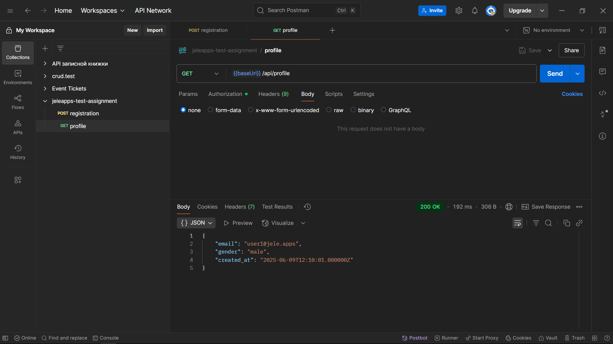
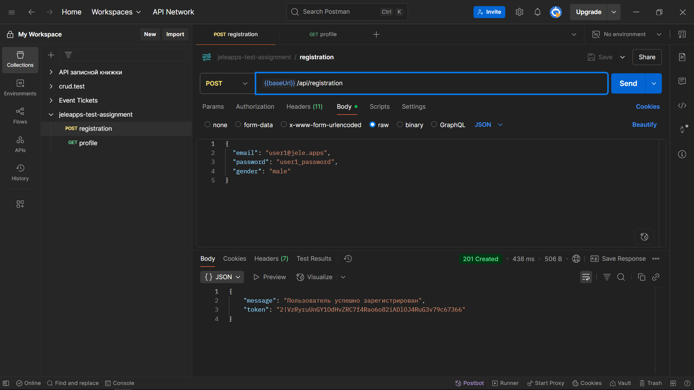

# README

## Тестовое задание:

1. Разработать метод апи «Регистрация нового юзера» api/registration с параметрами email, password, gender
2. Разработать апи метод api/profile для выдачи данных Пользователя
3. Предоставить документацию в виде Postman проекта
4. Представить скриншоты запросов из Postman


## Установка
* Требования:
    - PHP 8.0+
    - Composer
    - MySQL 8+/Postgres 13+

```bash
$ git clone https://github.com/AlexanderKurenkov/jeleapps-test-assignment.git
$ cd jeleapps-test-assignment

# Установить зависимости
$ composer install

# Указать учетные данные пользователя для подключения к базе данных в файле .env
$ cp .env.example .env

# Выполнить миграции (СУБД должна быть запущена)
$ php artisan migrate

# Запустить проект
$ php artisan serve --host=localhost --port=8081
```

## Тестирование

* Ссылка на Postman-проект

    - [https://www.postman.com/spaceflight-participant-52368985/public-workspace](https://www.postman.com/spaceflight-participant-52368985/public-workspace)

* GET-запрос к /profile




* POST-запрос к /registration

